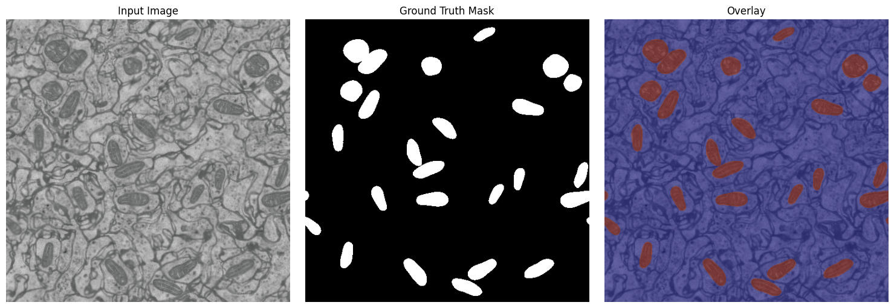
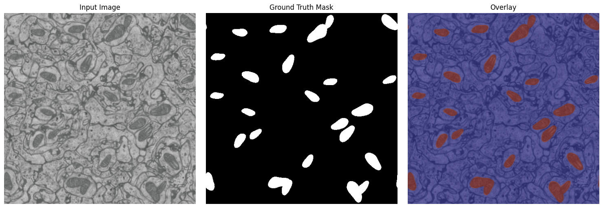
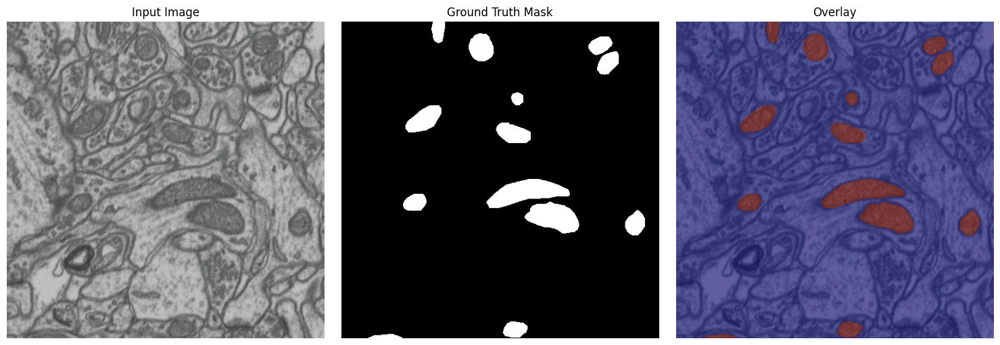
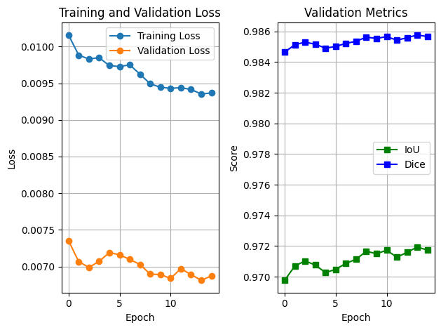
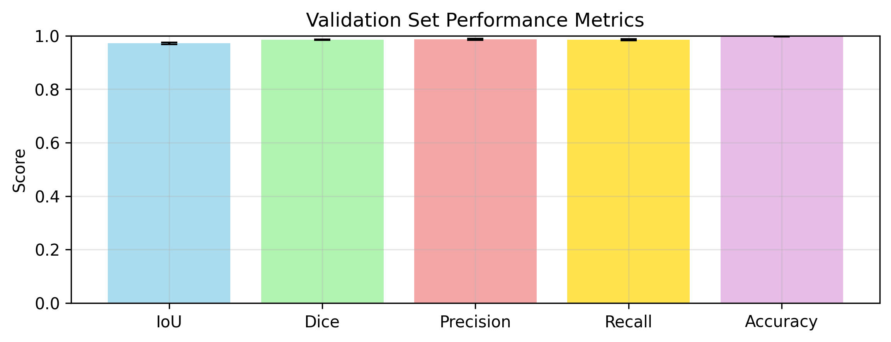
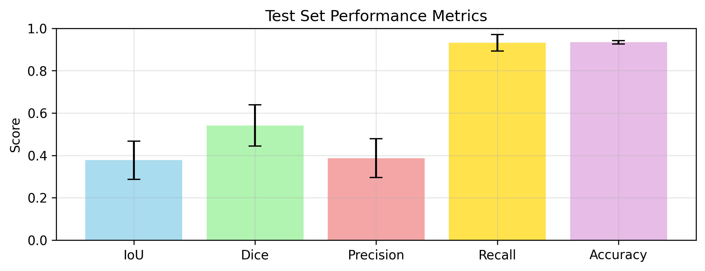
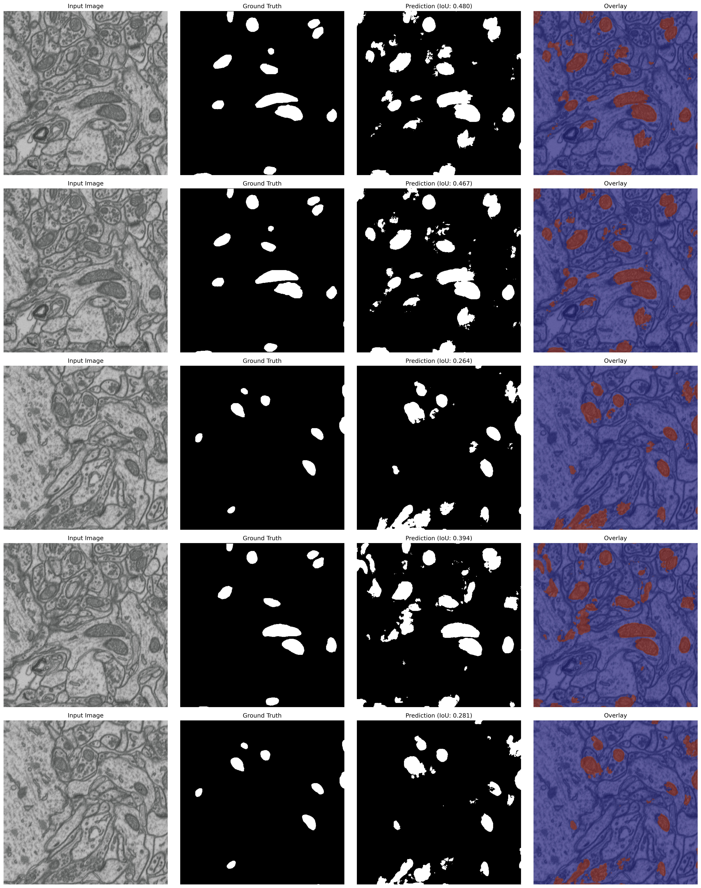
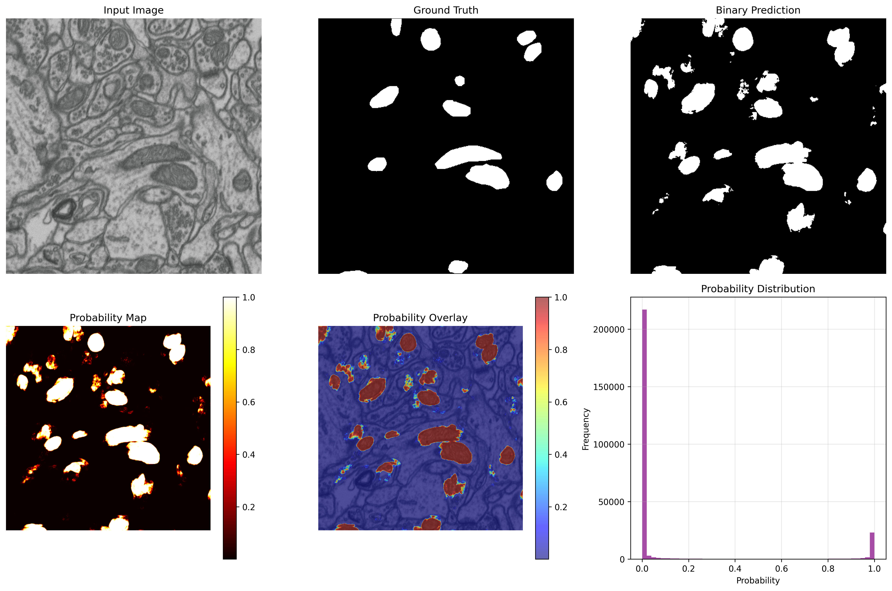

# Metric-Based Evaluation of a Synthetic EM Mitochondria Dataset

> **Note:**
> This repository documents an experimental study in which a U-Net model is trained on **1,000 fully synthetic mitochondria images**, validated on **200 synthetic images**, and evaluated on **5 real-world test images**. The objective is to assess the viability of a synthetic dataset through quantitative, metric-based segmentation evaluation.

A quantitative evaluation of a synthetic mitochondria dataset using segmentation metrics derived from a U-Net model trained on fully synthetic data and tested on real-world samples.

## Dataset Sample Preview

### Training Set (Synthetic)

### Validation Set (Synthetic)

### Test Set (Real)

## Traning Plot

## Defining Metrics

The trained model's performance is determined on the validation set & Test set, as evidenced by the following metrics (reported as mean ± standard deviation):

* **Intersection over Union (IoU)**
  IoU measures the overlap between the predicted segmentation and the ground truth. Values range from 0 to 1, where **higher is better**.

* **Dice Coefficient**
  Dice quantifies similarity between predicted and true masks, placing more emphasis on overlap. It ranges from 0 to 1, and **higher values indicate better segmentation quality**. A Dice score close to 1 signifies near-perfect predictions.

* **Precision**
  Precision measures how many of the predicted positive pixels are actually correct. **Higher precision is better**, indicating very few false positives.

* **Recall**
  Recall measures how many of the actual positive pixels were correctly identified by the model. **Higher recall is better**, showing the model rarely misses relevant regions (few false negatives).

* **Accuracy**
  Accuracy reflects the overall proportion of correctly classified pixels. While **higher accuracy is better**, it is most meaningful when interpreted alongside IoU and Dice in segmentation tasks.

## Training Evalution Metrics on Validation Set

### Validation Metrics (mean ± std):
- **IoU**: 0.9716 (std ± 0.0035)
- **Dice**: 0.9851 (std ± 0.0018)
- **Precision**: 0.9861 (std ± 0.0029)
- **Recall**: 0.9851 (std ± 0.0031)
- **Accuracy**: 0.9971 (std ± 0.0003)

> It is worth noting that the validation data is also synthetic, which naturally reduces domain variability and can make the task easier. Consequently, while these results are very strong, additional evaluation on real-world or out-of-distribution data is essential to fully assess generalization performance.

## Training Evalution Metrics on Test Set

### Test Metrics (mean ± std):
- **IoU**: 0.3774 ± 0.0905
- **Dice**: 0.5416 ± 0.0968
- **Precision**: 0.3868 ± 0.0916
- **Recall**: 0.9322 ± 0.0389
- **Accuracy**: 0.9345 ± 0.0079

> On the real-world EM test set, the model shows very high recall (0.93) but low precision (0.39), leading to moderate Dice (0.54) and low IoU (0.38). This indicates that the model detects most mitochondria pixels (few false negatives) but also predicts many non-mitochondria pixels as mitochondria (many false positives). The relatively high accuracy (0.93) is misleading in this context, as it is likely dominated by background pixels, which are abundant in EM images. The large standard deviations further suggest unstable performance across the very small test set (5 images), indicating sensitivity to image-specific characteristics.

## Test Set - Prediction on Real World EM Mitochondria Images

## Probability Analysis of Prediction

## Overall Interpretation:
The stark contrast between the near-perfect validation performance on synthetic data and the much poorer test performance on real data is a classic case of domain shift. The model has effectively learned the statistical properties, textures, contrast, and noise patterns of the synthetic EM images, which are consistent across training and validation, resulting in extremely high metrics and low variance. However, real EM images differ substantially in terms of acquisition noise, staining variability, structural complexity, and artifacts that are not fully captured by the synthetic generator. Consequently, when evaluated on real data, the model over-segments mitochondria, inflating recall while severely degrading precision, IoU, and Dice. This gap is amplified by the very small real-world test set, which increases metric variance and reduces robustness. Overall, the results indicate strong performance within the synthetic domain but limited generalization to real data.